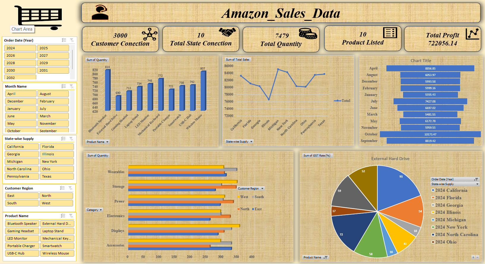

# Amazon Sales Dashboard

This project is an Excel-based dashboard that analyzes Amazon sales data. 
It helps in visualizing key metrics and understanding sales trends.

## Project Overview
- Analyzed raw Amazon sales data using Excel.
- Created PivotTables, charts, and slicers for interactive analysis.
- Transformed data into actionable insights.

## Features
- Total Customers, Products, Quantity Sold, and Profit
- Product-wise and State-wise sales analysis
- Monthly sales comparison
- Interactive dashboard with charts and slicers

## Tools Used
- Microsoft Excel (PivotTables, Charts, Slicers)

